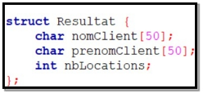
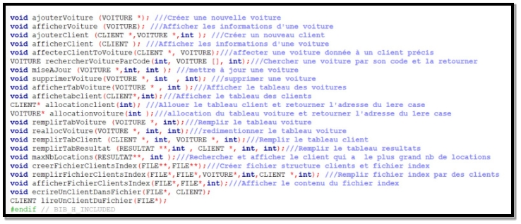

République Tunisienne
#### Université de la Mannouba
#### École Nationale des Sciences de l’Informatique
#### ENSI

![ref2]

**Projet C : Application de gestion d’une agence de location des voitures**

**E-Cars**

![ref2]

Réalisé par :

**Mohamed Rayen Jomaa**

**Groupe II1C**

` `**Encadré par :**

**Dr. Hatem Aouadi**

Année universitaire : **2023-2024**

**Table des matières**

[**Introduction générale**](#_bookmark0)	**1**

1. [Les structures](#_bookmark1)	2
   1. [Structure Date](#_bookmark2)	2
   1. [Structure Voiture](#_bookmark4)	2
   1. [Structure Location](#_bookmark6)	3
   1. [Structure Client](#_bookmark8)	3
   1. [Structure Resultat](#_bookmark10)	4

1. [Menu de l’application](#_bookmark12)	4
1. [Les prototypes](#_bookmark17)	6
1. [Realloc](#_bookmark18)	7
1. [Tableau dynamique d’adresses](#_bookmark21)	8
1. [Les fichiers](#_bookmark25)	9
1. [Les traitements](#_bookmark35)	17
   1. [La gestion des voitures](#_bookmark36)	17
   1. [La gestion des clients](#_bookmark43)	22

[**Conclusion générale**](#_bookmark50)	**25**

[**Annexes**](#_bookmark51)	**26**

**

**Table des figures**

1. [Code du structure Date](#_bookmark3)	2
1. [Code du structure Voiture](#_bookmark5)	3
1. [Code du structure Location](#_bookmark7)	3
1. [Code du structure Client](#_bookmark9)	4
1. [Code du structure Resultat](#_bookmark11)	4
1. [Menu principal](#_bookmark13)	5
1. [Menu de la gestion des clients](#_bookmark14)	5
1. [Menu de la gestion des voitures](#_bookmark15)	6
1. [La navigation entre les menus.](#_bookmark16)	6
1. [Prototypes des fonctions](#_bookmark19)	7
1. [Fonction realloc](#_bookmark20)	7
1. [Déclaration et allocation du tableau dynamique d’adresses](#_bookmark22)	8
1. [Remplissage du tableau résultat](#_bookmark23)	8
1. [Prototype du fonction du remplissage du tableau résultat](#_bookmark24)	9
1. [Création du fichier](#_bookmark26)	10
1. [Remplissage du fichier](#_bookmark27)	10
1. [Affichage du fichier](#_bookmark28)	10
1. [Lecture d’un client du fichier](#_bookmark29)	11
1. [Ecriture d’un client dans un fichier](#_bookmark30)	12
1. [Affichage du fichier clients](#_bookmark31)	13
1. [Affichage du fichier ClientsIndex](#_bookmark32)	14
1. [Modification d’un client à partir de sa position dans le fichier](#_bookmark33)	15
1. [Affichage du fichier apres modification](#_bookmark34)	16
1. [Code du tableau remplissage des voitures](#_bookmark37)	17
1. [Exécution du remplissage du tableau voitures](#_bookmark38)	18
1. [Modification d’une voiture](#_bookmark39)	19
1. [Exécution de modification d’une voiture](#_bookmark40)	20
1. [Suppression d’une voiture](#_bookmark41)	21
1. [Exécution de la suppression d’une voiture](#_bookmark42)	21
1. [Code de remplissage du tableau clients](#_bookmark44)	22
1. [Exécution du remplissage du tableau clients](#_bookmark45)	22
1. [Code d’affichage du tableau clients](#_bookmark46)	23
1. [Exécution de l’affichage du tableau clients](#_bookmark47)	23
1. [Code d’affichage du client qui a le plus grand nombre de locations](#_bookmark48)	24
1. [Exécution d’affichage du client qui a le plus grand nombre de locations](#_bookmark49)	24

# **Introduction générale**

Les applications de gestion jouent un rôle crucial dans la rationalisation des opérations commerciales, et dans le secteur de la location de voitures, elles deviennent un outil inestimable pour optimiser l’efficacité opérationnelle. Dans le monde en constante évolution de la mobilité, les agences de location de voitures font face à des défis complexes liés à la gestion de flotte, à la réservation, à la maintenance des véhicules, à la satisfaction client, et à la croissance économique.

Dans ce rapport je vais présenter mon application de gestion d’une agence de location des voitures, nommée E-cars, réalisée en langage C.

1. ## **Les structures**
   1. ### **Structure Date**
La structure Date est composée par 3 champs : jour qui est de type **int**, mois de type

**int** et annee de type **int**. Elle permet de stocker une date.

La figure [1](#_bookmark3) ci-jointe représente une capture d’écran du code de définition du structure Date.

**Fig. 1 : Code du structure Date**

1. ### **Structure Voiture**
La structure Voiture est composée par 5 champs : code qui est de type **int**, modele de type **char[50]**, marque de type **char[50]**, annee de type **int** qui désigne l’année de fabrication de la voiture et prixLocation de type **float**. Elle permet de stocker une voiture. La figure [2](#_bookmark5) ci-aprés représente une capture d’écran du code de définition du structure Voiture.

**Fig. 2 : Code du structure Voiture**

1. ### **Structure Location**
La structure Location est composée par 4 champs : code qui est de type **int** qui est l’identifiant de la location (nombre aléatoire composé par 9 chiffres), voitureLouee qui est de type **VOITURE \*** (un pointeur sur voiture), dateDebut de type **DATE** et dateFin de type **DATE**. Cette structure permet de stocker les détails d’une location d’une voiture donnée.

La figure [3](#_bookmark7) ci-après représente une capture d’écran du code de définition du structure Location.

**Fig. 3 : Code du structure Location**

1. ### **Structure Client**
La structure Client est composée par 6 champs : prenom qui est de type **char[50]**, nom de type **char[50]**, téléphone de type **int**,le nombreLocations de type **int** et locations qui est de type **LOCATION \*** qui renseigne les locations d’un client donné. Cette structure permet de stocker les détails d’un client donné.

La figure [4](#_bookmark9) ci-aprés représente une capture d’écran du code de définition du structure Client.

**Fig. 4 : Code du structure Client**

1. ### **Structure Resultat**
La structure Resultat est composée par 3 champs : nomClient qui est de type **char[50]**, prenomClient de type **char[50]** et nbLocations de type **int**. Cette structure permet de stocker le nombre de locations pour chaque client.

La figure [5](#_bookmark11) ci-jointe désigne une capture d’écran du code de définition du structure  Resultat.

**Fig. 5 : Code du structure Resultat**

1. ## **Menu de l’application**
Notre application est composée par un menu principal constitué par : La gestion des voitures et la gestion des clients.

La figure [6](#_bookmark13) ci-jointe représente le menu principal de notre application.

**Fig. 6 : Menu principal**

En choisissant une option, un sous menu apparait au chef d’agence pour manipuler soit les voitures soit les clients. Ci-après, la figure [7](#_bookmark14) renseigne le menu de la gestion des clients.

**Fig. 7 : Menu de la gestion des clients**

Et la figure [8](#_bookmark15) illustre le menu de la gestion des voitures.

**Fig. 8 : Menu de la gestion des voitures**

**Notez bien** : Il y’a une navigation entre les menus ; si le chef d’agence est dans le menu de la gestion des clients il peut revenir au menu principal comme le montre la figure [9](#_bookmark16).

**Fig. 9 : La navigation entre les menus.**

1. ## **Les prototypes**
La figure [10](#_bookmark19) ci-après illustre les prototypes des fonctions de notre application.

1. ## **Realloc**
**Fig. 10 : Prototypes des fonctions**

La fonction **realloc** en langage C est utilisée pour modifier la taille de la mémoire allouée dynamiquement précédemment par malloc, calloc, ou realloc lui-même. Elle permet de réallouer de la mémoire pour un bloc de mémoire déjà alloué, en modifiant sa taille.

Dans notre cas, nous avons utilisé **realloc** pour redimentionner le tableau des voitures. Si le chef d’agence veut ajouter des voitures supplémentaires en plus de sa base de données, il peut le faire grace à la fonction realloc.

Ci-dessous, nous avons présenter dans la figure [11](#_bookmark20) la capture d’écran de la fonction
##### **reallocVoiture**.

**Fig. 11 : Fonction realloc**

1. ## **Tableau dynamique d’adresses**
Lors du développement du mon application, j’ai recours à utiliser un tableau    dynamique d’adresses de structure RESULTAT.

J’ai déclaré le tableau et allouer de l’espace mémoire de cette façon comme le montre la figure [14](#_bookmark24).

**Fig. 12 : Déclaration et allocation du tableau dynamique d’adresses**

La figure ci-après illustre le remplissage du tableau dynamique **tableauResultats**.

**Fig. 13 : Remplissage du tableau résultat**

**Fig. 14 : Prototype de fonction du remplissage du tableau résultat**
1. ## **Les fichiers**
J’ai utilisé deux fichiers binaires ; fichier Clients et fichier ClientsIndex. Le fichier Clients stocke les données des clients de l’agence alors que ClientsIndex stocke la position du curseur dans le fichier Clients. Les figures ci-après représente les fonctions de gestion des fichiers.

**Fig. 15 : Création du fichier**

**Fig. 16 : Remplissage du fichier**

**Fig. 17 : Affichage du fichier**

**Fig. 18 : Lecture d’un client du fichier**

**Fig. 19 : Ecriture d’un client dans un fichier** 

La figure [20](#_bookmark31) représente l’affichage du contenu du fichier Clients. 

**Fig. 20 : Affichage du fichier clients**

Ci-jointe, la figure [21](#_bookmark32) représente l’affichage du fichier ClientsIndex.

**Fig. 21 : Affichage du fichier ClientsIndex**

Grace à cette application, le chef d’agence a la main de modifier les données d’un client à partir de sa position dans le fichier comme illustre la figure [22 .](#_bookmark34)

**Fig. 22 : Modification d’un client à partir de sa position dans le fichier**

**Fig. 23 : Affichage du fichier après modification**

1. ## **Les traitements**
   1. ### **La gestion des voitures**
      0. ##### **Remplissage**
Ci-joint la figure [29](#_bookmark42) montre le code de remplissage du tableau voitures.

**Fig. 24 : Code du tableau remplissage des voitures**

**Fig. 25 : Exécution du remplissage du tableau voitures**

0. ##### **Modification**
Ci-joint le code de modification d’une voiture

**Fig. 26 : Modification d’une voiture**

**Fig. 27 : Exécution de modification d’une voiture**

0. ##### **Suppression**
Ci-joint la figure [29](#_bookmark42) montre le code de suppression d’une voiture.

**Fig. 28 : Suppression d’une voiture**

**Fig. 29 : Exécution de la suppression d’une voiture**

1. ### **La gestion des clients**
   0. ##### **Remplissage**
Ci-joint la figure [33](#_bookmark47) montre le code de remplissage du tableau des clients.

**Fig. 30 : Code de remplissage du tableau clients**

**Fig. 31 : Exécution du remplissage du tableau clients**

0. ##### **Affichage**
Ci-joint la figure [33](#_bookmark47) montre le code d’affichage du tableau des clients.

**Fig. 32 : Code d’affichage du tableau clients**

**Fig. 33 : Exécution de l’affichage du tableau clients**

0. ##### **Le client qui a le nombre de locations le plus élevé**
Ci-joint la figure [35](#_bookmark49) montre le code d’affichage du tableau des clients.

`	`**Fig. 34 : Code d’affichage du client qui a le plus grand nombre de locations**

**Fig. 35 : Exécution d’affichage du client qui a le plus grand nombre de locations**

# **Conclusion générale**

**Conclusion générale**

En conclusion, la création d’une application de gestion pour une agence de location de voitures en langage C a été une expérience enrichissante. Ce projet m’a offert l’opportunité d’approfondir mes connaissances en programmation et de développer des compétences précieuses dans plusieurs domaines.

Travailler en langage C m’a permis de maîtriser les aspects fondamentaux de la programmation, notamment la gestion de la mémoire, la manipulation des pointeurs et la modularité du code. La conception modulaire du système, avec ses différents modules pour la gestion des véhicules, des clients, et des locations, a renforcé ma compréhension de l’organisation logicielle.

# **Annexes**

[ref1]: Aspose.Words.5ea7dd9a-2e8c-4dda-9a21-72bfc151e25a.001.png
[ref2]: Aspose.Words.5ea7dd9a-2e8c-4dda-9a21-72bfc151e25a.003.png
